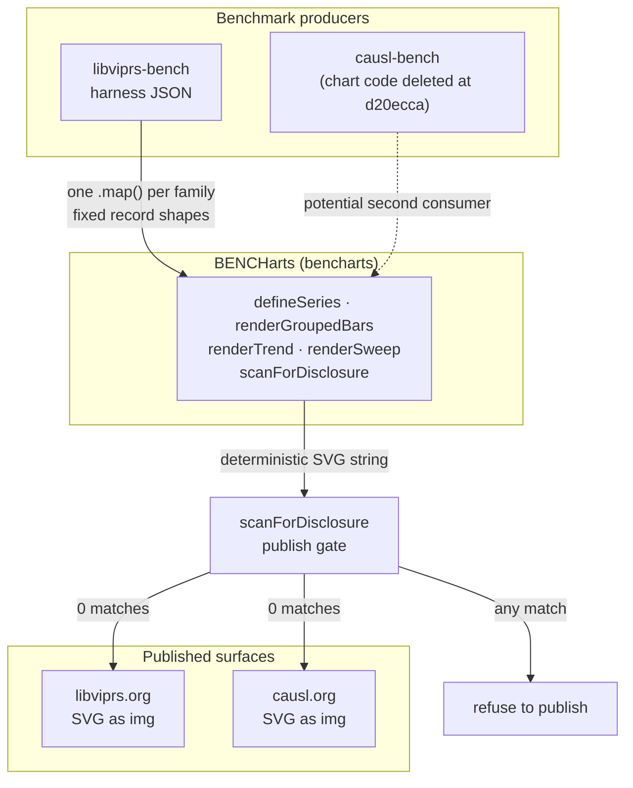
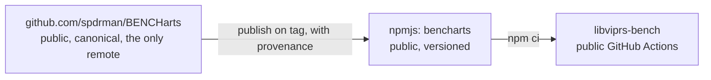
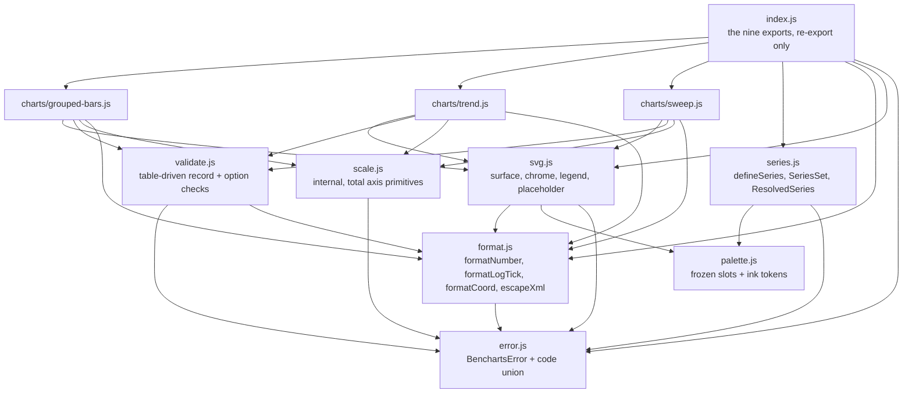

# BENCHarts: architecture

Status: **proposed**, pairs with `docs/SPEC.md`.

`SPEC.md` decides what the library draws and how it refuses. It left four
questions open in §9 and two of them are blocking. This document covers the
shape of the system around those decisions: what it must do, what it must never
cost, who consumes it, how the code is partitioned, and how a chart gets from
this repo onto a public site. The four open questions are answered here, each
with an ADR under `docs/adr/`.

Nothing here re-opens D1 to D10. Where I change something the spec already
wrote, I say so in one line and the ADR carries the reasoning. There is exactly
one of those: the hand written `types/index.d.ts` in §7, revised by ADR-002.

## 1. Requirements

### Functional

| # | Requirement | Source |
| --- | --- | --- |
| F1 | Render grouped bars, trend and sweep families as SVG strings from fixed record shapes | SPEC D1, §2 |
| F2 | Resolve series identity in two phases and refuse an unknown key | SPEC D3 |
| F3 | Refuse any programming or pipeline error with a coded `BenchartsError` | SPEC D2, §3 |
| F4 | Degrade on exactly three data semantics: `NaN`/infinite value, absent cell, non-positive on a log axis | SPEC §3 |
| F5 | Emit a chart that is legible in light and dark without host CSS | SPEC §5, ADR-004 |
| F6 | Expose `scanForDisclosure` so a consumer can refuse to publish a leaking SVG | SPEC R-PROV-4 |
| F7 | Carry no project vocabulary from libviprs or causl in its API or output | SPEC D4 |

### Non-functional, with the number that fails the build

| Property | Budget | Enforced by |
| --- | --- | --- |
| Per-chart render, warm | ≤ 200 µs | min-of-15 interleaved estimator |
| 28-chart run, in process | ≤ 5 ms | same |
| 28-chart run, fresh process | ≤ 15 ms | same |
| Bytes per chart | ≤ 24,000 | golden byte count, deterministic |
| Bytes per run | ≤ 320 KB raw, ≤ 60 KB gzip | golden, deterministic |
| Bytes per record | ≤ 800 B | linear growth assertion, deterministic |
| Peak RSS over bare Node | ≤ +32 MB | measured in the perf suite |
| Test suite wall clock | ≤ 2 s | CI |
| Runtime dependencies | **0** | packaging test, no `dependencies` key |
| Colour separation, any adjacent pair | ΔE ≥ 6.0 under deutan, protan, tritan | palette validator, build fails on FAIL |
| Output determinism | byte identical for a given input, across runs and input permutations | `golden/RENDERS.sha256` |
| XML validity | well formed XML 1.0 for every input the library accepts | source scanning test plus a parse test |
| Disclosure | zero matches from `scanForDisclosure` on every golden | canary test in the library and in each consumer |

The budgets are not there to chase microseconds. The whole 28-chart run is
0.83 ms inside an 80 ms CLI. They exist to catch a class of bug: a legend
emitted per bar, an axis that draws 301 decades, a quadratic cell fill. The
per-record byte budget is the one that earns its place, because it is
deterministic and it catches per-mark duplication that a total on small inputs
never would.

### Constraints I measured rather than assumed

| # | Constraint | How I checked it | Consequence |
| --- | --- | --- | --- |
| C1 | The only live consumer, `libviprs-bench`, is **public on GitHub** | `gh repo view` reports `PUBLIC` | Anything it vendors or installs is public source, so privacy is not on the table |
| C2 | Its CI **cannot reach private Gitea** | `.github/workflows/contract.yml:13` says so in its own words | A private Gitea package serves nobody who can install it |
| C3 | It has **no `package.json`, no lockfile, no `node_modules`** | none of the three exist in the repo | Installing from a registry adds a step to a pipeline that has none today |
| C4 | `bencharts` is free on public npm, and `spdrman/BENCHarts` did not exist | registry returns 404, `gh repo view` could not resolve it | Both the name and the home were available, see ADR-007 |
| C5 | The internal git host's name appears **zero times** in the public `libviprs-bench` repo | `grep` across its working tree | That hostname is kept out of public repos on purpose, so the two pre-existing commits were rewritten before the first public push, not fixed forward |
| C6 | The `causl-ci` credential was read only and `git push` to the Gitea repo returned a bare 403 | `git push --dry-run` returned `remote: Forbidden ... 403` | Moot under ADR-007: GitHub is now the only remote |
| C7 | A frozen vendoring gate with blob-sha manifests **already works** next door | `tools/contract/sync-contract.sh` in libviprs-bench | The alternative to a registry is proven, not hypothetical |

## 2. Context

The trust boundary sits on the left edge of the library: semi-trusted harness
JSON in, SVG served from a public origin out. That is why refusal is the
library's main feature and why the provenance scan runs on the consumer's side
of the boundary as well.

## 3. Distribution

ADR-001 decided to publish publicly rather than vendor or stay private.
ADR-007 then took the repo out of causl altogether, which collapsed the
topology to the shortest form available:

One remote, one credential, one name. The mirror in the earlier version existed
to keep a private canonical source, and the audit showed that privacy was never
available: the only consumer is public, so any route that reaches it publishes
the source. Removing the pretence removed the machinery with it.

## 4. Module boundaries

Four rules, each a test rather than a convention (ADR-006):

1. `error.js` and `palette.js` import nothing. They are leaves.
2. No module imports `index.js`. It re-exports and holds no logic.
3. No file under `charts/` imports another file under `charts/`.
4. `svg.js` never imports a chart family. Chrome does not know what it frames.

The dependency graph is acyclic and shallow on purpose: every renderer reaches
the same four helpers, so a fix to escaping or formatting lands in all three
families at once. That is the whole reason this repo exists, expressed as an
import rule.

### Where the layers sit

| Layer | Files | Knows about |
| --- | --- | --- |
| Refusal | `error.js`, `validate.js` | codes, shapes, option names |
| Values | `format.js`, `scale.js` | numbers, strings, escaping, the numeric window |
| Identity | `series.js`, `palette.js` | keys, labels, colours, capacity |
| Geometry and chrome | `svg.js` | the canvas, axes, legend, surface, tokens |
| Families | `charts/*.js` | one picture each |
| Surface | `index.js`, `types/` | what a caller may touch |

## 5. The four open questions, answered

| Q | Question | Answer | ADR |
| --- | --- | --- | --- |
| Q1 | Hosting, given the only consumer cannot reach private Gitea | Publish publicly rather than vendor or stay private, and put the source at `github.com/spdrman/BENCHarts` as `bencharts` | [ADR-001](adr/ADR-001-distribution.md), [ADR-007](adr/ADR-007-public-home.md) |
| Q2 | The real series capacity number | There is no global number. Capacity is the length of the fallback palette in play, and exhausting it throws | [ADR-003](adr/ADR-003-series-capacity.md) |
| Q3 | Does the SVG own its background | Yes, opaque by default, with `surface: 'transparent'` for inlined use. Theme arrives per file, not per attribute | [ADR-004](adr/ADR-004-surface-and-theme.md) |
| Q4 | Is re-rendering the published charts in scope | No for 1.0. It is two live defects on public sites and gets two bug reports now | [ADR-005](adr/ADR-005-republishing-scope.md) |

One decision the spec did not raise, and I think it has to be made before P0:
the source language and how types are delivered. `SPEC.md` §7 lists a hand
written `types/index.d.ts`. [ADR-002](adr/ADR-002-source-language.md) revises
that to JSDoc annotated JavaScript with the declarations generated by `tsc`,
which keeps the zero-build, zero-dependency shape while making the types
checkable against the implementation instead of a parallel document that drifts.

## 6. Risks

| # | Risk | Likelihood | Impact | Mitigation |
| --- | --- | --- | --- | --- |
| R1 | ~~Nothing can land in this repo, because `causl-ci` is read only and `git push` 403s~~ | **Resolved** | was blocking P0 | ADR-007 moved the repo to GitHub under an account that can push. The twelve phases land as ordinary commits and PRs |
| R2 | Q1 stays open and P11 never completes, so 1.0 ships with zero consumers and becomes the fifth divergent descendant | Moderate | Fatal to the point of the repo | ADR-001 decided now, and P11 made the definition of 1.0 rather than a follow-up |
| R3 | The palette change re-baselines every golden in two consumers at once, and a reviewer approves a diff too large to read | High | Silent visual regression | Land the palette (P3) before any family golden exists. Re-baseline consumers in their own PR, with the before and after rendered side by side |
| R4 | The published charts stay wrong while the library gets built, and both sites keep serving a failing palette and 18 fake `0ms` bars | Certain until fixed | Public accessibility and correctness defect | ADR-005 files them as bugs now, separately from 1.0 |
| R5 | Types drift from the implementation and a consumer trusts a signature that no longer holds | High with hand written `.d.ts` | Wrong at the seam the library exists to fix | ADR-002: generate them, check them in CI, ship the generated file |
| R6 | The numeric window and the caps read as arbitrary, get raised under pressure, and `1e300` draws a 263 KB axis again | Moderate | Heap death in a publish pipeline | Every cap names itself in the refusal message and cites the measurement in a comment. A test asserts the window, not the timing |
| R7 | A second consumer arrives and needs a fourth family, so the internal scale helpers get exported in a hurry | Low for 1.0 | API frozen by accident | D8 already chose internal. A `/primitives` subpath can be added without a break, so the hurry is affordable |

## 7. What happens before P0

Three things, in this order, none of them code:

1. **Archive the Gitea repo** at `causl/BENCHarts`, so there is one canonical
   source rather than two that can drift. It needs a credential this machine
   does not have, so it is yours to do. Nothing is blocked behind it.
2. **Close `libviprs-bench` PR #105 unmerged** and say why in the issue. It is
   still open and still draft. It makes the series identity injectable at a seam
   a four expert review called wrong, and this extraction subsumes it. Leaving it
   open invites someone to merge the seam this repo replaces. Issue #104 stays
   open and gets re-pointed at the adoption phase (P11).
3. **File the two published-chart defects** (ADR-005), so the live problems are
   tracked where they live rather than inside a 1.0 milestone.

## 8. What I verified, and what I did not

Verified today, by running it: the 403 on push, `libviprs-bench` being public,
`contract.yml:13` saying what the spec quotes, the absence of a `package.json`
in the consumer, `bencharts` being free on npm, `spdrman/BENCHarts` not
existing, the internal git host's name appearing nowhere in the public consumer repo, and PR
#105 still open in draft.

Not verified, and flagged where it matters: that `prefers-color-scheme` inside
an SVG loaded through `` fires on all three engines we publish to. ADR-004
depends on it and P10 already screenshots under dark emulation, so that phase is
where it gets proven. I have reasoned about it, not measured it.
